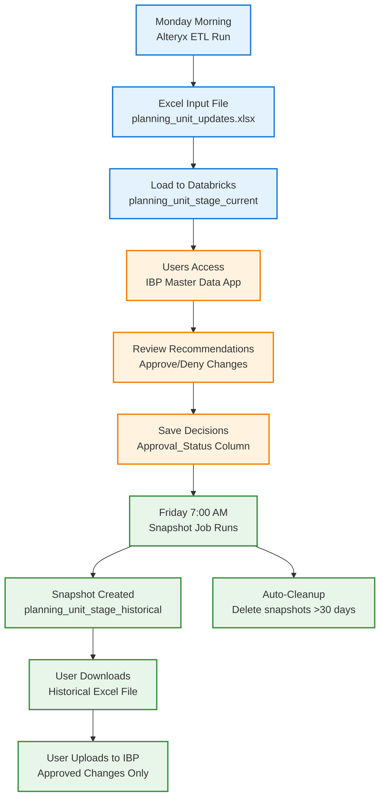

# IBP Master Data Automation - Weekly Process Flow

## Overview

This document describes the complete weekly workflow for managing planning unit master data updates from source data ingestion through IBP integration.

---

## Weekly Process Timeline

```
┌─────────────────────────────────────────────────────────────────────────┐
│                    WEEKLY AUTOMATION CYCLE                               │
└─────────────────────────────────────────────────────────────────────────┘

    MONDAY                         TUESDAY-THURSDAY                  FRIDAY
    ↓                                    ↓                             ↓
┌──────────┐                      ┌──────────┐                   ┌──────────┐
│ ALTERYX  │                      │  USERS   │                   │ SNAPSHOT │
│   ETL    │                      │  REVIEW  │                   │   JOB    │
└──────────┘                      └──────────┘                   └──────────┘
```

---

## Detailed Weekly Flow Diagram



---

## Step-by-Step Process

### 📅 **MONDAY - Data Ingestion**

**Time:** Morning (automated)

1. **Alteryx ETL Job Runs**
   - Source: Various data systems
   - Process: Data transformation and validation
   - Output: Excel file with planning unit recommendations

2. **Excel File Generated**
   - File: `planning_unit_updates.xlsx` (or similar)
   - Contains: Product/location combinations with recommendations
   - Columns: PRDID, LOCID, Current Planning Unit, Recommended Planning Unit, etc.

3. **Data Loaded to Databricks**
   - Target Table: `cpg_reporting_sandbox.default.planning_unit_stage_current`
   - Method: Alteryx → Databricks connector or manual upload
   - Result: Fresh data available for review

---

### 📋 **TUESDAY - THURSDAY - Review & Approval Period**

**Time:** Business hours

1. **Users Access the App**
   - URL: Databricks Apps - IBP Master Data Automation
   - Users: Business analysts, planning team members

2. **Review Recommendations**
   - View: All pending planning unit change recommendations
   - Actions: 
     - Review current vs. recommended planning units
     - Check recommendation reasons
     - Apply filters by product category, location, etc.

3. **Make Decisions**
   - **Approve:** Click "✓" toggle for recommended changes
   - **Deny:** Click "✗" toggle for rejected changes
   - **Edit:** Modify "Proposed Planning Unit" if needed (override recommendation)

4. **Submit Approvals**
   - Click: "Submit Approvals" button
   - Result: Decisions saved to `Approval_Status` column in database
   - Approved records: `Approval_Status = 'Approved'`
   - Denied records: `Approval_Status = 'Denied'`
   - Effect: Approved/denied records removed from app view

---

### 📸 **FRIDAY - Snapshot & Export**

**Time:** 7:00 AM (automated) + User action

1. **Automated Snapshot Job Runs**
   - Trigger: 7:00 AM every Friday (Databricks Job)
   - Action: 
     ```sql
     INSERT INTO planning_unit_stage_historical
     SELECT CURRENT_DATE() as snapshot_date, *
     FROM planning_unit_stage_current
     ```
   - Result: Complete snapshot of current state (including approvals)

2. **User Downloads Historical Data**
   - Time: Anytime after 7:00 AM
   - Action: Click "📥 Download Historical Data" button in app
   - File: `planning_unit_historical_YYYYMMDD_HHMMSS.xlsx`
   - Contents: 
     - All historical snapshots (last 30 days)
     - **Filters to approved records** for IBP upload
     - Includes: snapshot_date, product/location details, approved changes

3. **User Prepares for IBP Upload**
   - Open Excel file
   - Filter/format as needed for IBP
   - Extract only **Approved** changes from latest snapshot date

4. **User Uploads to IBP**
   - Method: IBP data upload interface
   - Data: Approved planning unit changes only
   - Result: IBP system updated with new planning units

5. **Automatic Cleanup**
   - Action: Delete snapshots older than 30 days
   - Result: Maintain ~4-5 weeks of historical data

---

## Architecture Diagram

```
┌─────────────────────────────────────────────────────────────────────────┐
│                         DATA FLOW ARCHITECTURE                           │
└─────────────────────────────────────────────────────────────────────────┘

┌───────────────┐         ┌───────────────────────────────────┐
│    MONDAY     │         │                                   │
│               │         │  Databricks Tables                │
│  Alteryx ETL  │────────▶│  ┌─────────────────────────────┐ │
│               │         │  │ planning_unit_stage_current │ │
└───────────────┘         │  │  - PRDID, LOCID             │ │
                          │  │  - Current Planning Unit    │ │
                          │  │  - Recommended Planning Unit│ │
                          │  │  - Approval_Status          │ │
                          │  │  - Last_Refresh_Date        │ │
                          │  └─────────────────────────────┘ │
                          │              │                    │
                          │              │                    │
                          └──────────────┼────────────────────┘
                                         │
                                         ▼
                          ┌──────────────────────────────────┐
                          │   IBP Master Data App            │
                          │   (Databricks Apps)              │
                          │                                  │
                          │  ┌────────────────────────────┐ │
                          │  │  React Frontend            │ │
                          │  │  - Planning Unit Table     │ │
                          │  │  - Approve/Deny Toggles    │ │
                          │  │  - Filter Dropdowns        │ │
                          │  │  - Download Button         │ │
                          │  └────────────────────────────┘ │
                          │               │                  │
                          │               ▼                  │
                          │  ┌────────────────────────────┐ │
                          │  │  Flask Backend             │ │
                          │  │  - /api/data               │ │
                          │  │  - /api/submit             │ │
                          │  │  - /api/historical/download│ │
                          │  └────────────────────────────┘ │
                          └──────────────┬───────────────────┘
                                         │
                                         │ (Writes)
                                         ▼
                          ┌─────────────────────────────────┐
┌───────────────┐         │  planning_unit_stage_historical │
│    FRIDAY     │         │   - snapshot_date (2026-01-31) │
│  7:00 AM Job  │────────▶│   - All columns from current   │
│               │         │   - Includes Approval_Status   │
└───────────────┘         │   - Retention: 30 days         │
                          └─────────────────────────────────┘
                                         │
                                         │ (Downloads)
                                         ▼
                          ┌─────────────────────────────────┐
                          │  Excel Export                   │
                          │  historical_data_20260131.xlsx  │
                          │                                 │
                          │  - Multiple weeks of snapshots  │
                          │  - Filter to Approved only      │
                          └─────────────────────────────────┘
                                         │
                                         │ (Manual Upload)
                                         ▼
                          ┌─────────────────────────────────┐
                          │  IBP System                     │
                          │  Planning Unit Master Data      │
                          └─────────────────────────────────┘
```

---

## Weekly Schedule Summary

| Day | Time | Activity | Owner | System |
|-----|------|----------|-------|--------|
| **Monday** | Morning | Alteryx ETL runs | Automated | Alteryx → Databricks |
| **Monday** | After ETL | Data loaded to `planning_unit_stage_current` | Automated | Databricks |
| **Mon-Thu** | Business Hours | Users review and approve/deny changes | Users | IBP Master Data App |
| **Mon-Thu** | Continuous | Approval decisions saved to database | App | Databricks |
| **Friday** | 7:00 AM | Snapshot job captures current state | Automated | Databricks Job |
| **Friday** | After 7 AM | User downloads historical Excel file | User | IBP Master Data App |
| **Friday** | After download | User uploads approved changes to IBP | User | IBP System |
| **Friday** | 7:00 AM | Cleanup deletes snapshots >30 days | Automated | Databricks Job |

---

## Key Features

### 🔄 **Automation**
- ✅ Monday: Alteryx ETL (automated)
- ✅ Friday 7:00 AM: Snapshot creation (automated)
- ✅ Friday 7:00 AM: Old data cleanup (automated)

### 👥 **User Interaction**
- ✅ Tue-Thu: Review recommendations
- ✅ Tue-Thu: Approve/deny changes
- ✅ Friday: Download historical data
- ✅ Friday: Upload to IBP

### 📊 **Data Tracking**
- ✅ Historical snapshots (30 days)
- ✅ Approval status tracking
- ✅ Audit trail for all decisions

### 🔒 **Data Integrity**
- ✅ Approved/denied records hidden from app
- ✅ Only approved changes exported
- ✅ Historical record preservation

---

## Files & Resources

**Databricks Tables:**
- `cpg_reporting_sandbox.default.planning_unit_stage_current` - Live data
- `cpg_reporting_sandbox.default.planning_unit_stage_historical` - Snapshots

**Databricks Jobs:**
- `master-data-historical-snapshot-task` - Friday 7:00 AM

**Application:**
- IBP Master Data Automation App (Databricks Apps)

**Documentation:**
- `HISTORICAL_DATA_SETUP.md` - Setup and maintenance guide
- `WEEKLY_PROCESS_FLOW.md` - This document

---

## Troubleshooting

**Issue: No new data on Tuesday**
- Check: Alteryx job ran successfully on Monday
- Verify: `planning_unit_stage_current` has new `Last_Refresh_Date`

**Issue: Snapshot file is empty**
- Check: Friday job ran successfully (Databricks Workflows)
- Verify: `planning_unit_stage_historical` has records for current week

**Issue: Can't download historical data**
- Check: At least one snapshot exists in historical table
- Verify: App has database connectivity (check `/api/health`)

---

## Support Contacts

- **Databricks Issues:** IT Support / Databricks Admin
- **App Issues:** kevin.bellefeuil@gapac.com
- **IBP Upload Questions:** IBP Planning Team
- **Alteryx ETL Issues:** Data Engineering Team
